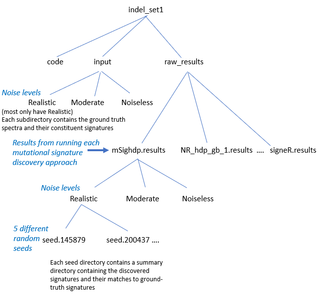

This repository contains supplementary files - synthetic data, code, results of running mutational-signature
discovery programs, and analysis of their results - 
for the paper

> Mo Liu, Yang Wu, Nanhai Jiang, Arnoud Boot, Steven G. Rozen,
> ***mSigHdp: hierarchical Dirichlet process mixture modeling for mutational signature discovery***, 

See https://github.com/steverozen/mSigHdp and https://github.com/steverozen/hdpx for `mSigHdp`.

### Directory structure

The top-level directories are:

#### Directory `common_code`

This directory contains

- Code used by other code in the `code` subdirectories of the directories containing the main datasets and results.

- Code to generate initial versions of tables and figures in the paper.
  
- Some subdirectories for particular analyses, which sometimes contain initial versions of tables or figures in the paper.

#### Directory `output_for_paper`

This directory contains output from code in `common_code` that is used in the paper.

#### Multiple directories containing main datasets and results

These contain the results of running the mutational signature discovery programs, and usually the input data.

- `indel_set1`, `indel_set2`,
   `SBS_set1` and `SBS_set2` are the main synthetic data sets as documented in the paper.

-  `indel_set1_down_samp`, `indel_set2_down_samp`, `SBS_set1_down_samp` and
   `SBS_set2_down_samp` contain
   results of running mSigHdp with different downsampling thresholds
   on the synthetic data in `indel_set1`, `indel_set2`, `SBS_set1`, and `SBS_set2`.
   (The `…down_samp` folders use the corresponding original datasets, e.g. `indel_set1_down_samp` uses the same data as `indel_set1`.)
   
- `sens_SBS35_x_728` and `sens_SBS35_x_1066` Data with SBS35
  "spiked into" x (the number of) tumors; see Supplementary Figure S10 of the paper.
  `728` and `1066` refer to arbitrary random seeds.
  
The substructure of each directory is:
  

### License
 
 Copyright (C) 2022 Steven G Rozen, Mo Liu, and Yang Wu

 Code and data in this repository are free software: you can redistribute them and/or modify
 them under the terms of the GNU General Public License as published by
 the Free Software Foundation, either version 3 of the License, or
 (at your option) any later version.

 This code and data are distributed in the hope that they will be useful,
 but WITHOUT ANY WARRANTY; without even the implied warranty of
 MERCHANTABILITY or FITNESS FOR A PARTICULAR PURPOSE.  See the
 GNU General Public License for more details.

 You should have received a copy of the GNU General Public License
 along with this code and data.
 If not, see <http://www.gnu.org/licenses/>.
    
